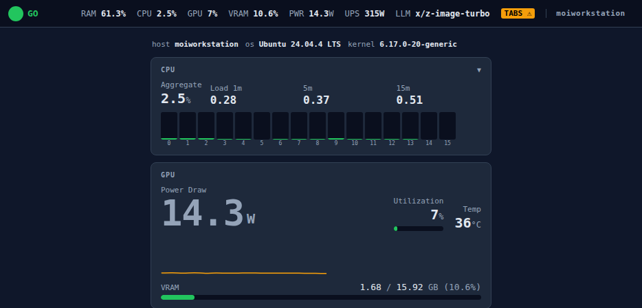
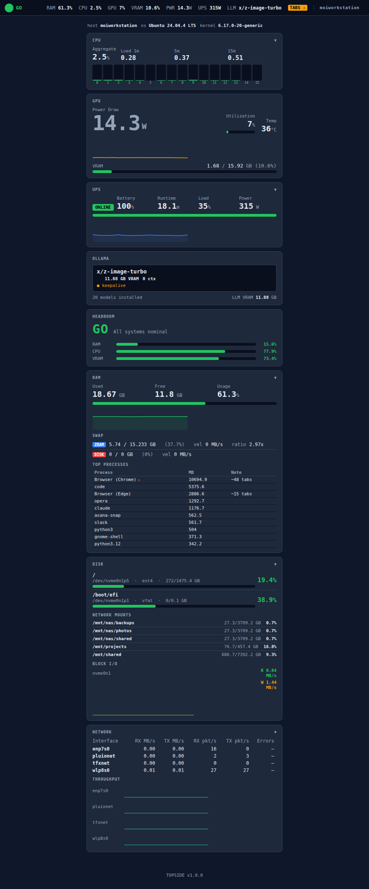

# TOPSIDE

TOPSIDE is a local-first, plugin-driven system monitor built for workstations running inference workloads, live demos, or anything where a RAM ambush or power event is not an option.

A FastAPI backend pushes live metrics over WebSocket to a zero-build-step HTML dashboard. A plugin contract means new collectors are a single file drop. A Headroom strip — pinned, always visible, peripheral-friendly — gives you a one-glance **GO / EASE_IN / HOLD** signal before you fire the next drill.

No cloud. No agents. No npm. Runs anywhere Python 3.12 runs.

## Contents

- [What it monitors](#what-it-monitors)
- [Headroom](#headroom)
- [HTTP API](#http-api)
- [Architecture](#architecture)
- [Notifications](#notifications)
- [Configuration](#configuration)
- [Requirements](#requirements)
- [Python packages](#python-packages)
- [Install](#install)
- [Running](#running) (includes systemd autostart)
- [Developing from source](#developing-from-source)
- [Security and network exposure](#security-and-network-exposure)
- [Troubleshooting](#troubleshooting)
- [License](#license)
- [Constraints](#constraints)

---



<details>
<summary>Full screenshot</summary>



</details>

---

## What it monitors

| Plugin | Metrics | Interval |
| --- | --- | --- |
| `ram_monitor` | Used / free / total RAM, swap (zram + disk) with velocity and compression ratio, top-10 processes grouped by executable with browser tab estimates and earlyoom risk flags | 2 s |
| `cpu_monitor` | Per-core utilization, aggregate %, load averages (1 m / 5 m / 15 m), per-core frequency | 2 s |
| `gpu_monitor` | GPU utilization %, VRAM used / total / %, temperature °C, power draw W — via pynvml, no nvidia-smi subprocess | 2 s |
| `ups_monitor` | Load %, real power W, input voltage, battery charge %, runtime estimate, on-battery / low-battery flags, power-climbing trend — via apcupsd NIS (TCP 3551, stdlib sockets), graceful degraded mode when unavailable | 2 s |
| `ollama_monitor` | Loaded models with VRAM footprint, parameters, quantization, context length, and keepalive / unload timer — via Ollama REST API, no subprocess | 5 s |
| `ollama_tokens` | Token throughput: `completion_tokens_per_s`, `prompt_tokens_per_s`, cumulative totals, and per-model breakdown — via Ollama's Prometheus `/metrics` endpoint (requires Ollama 0.5+, `OLLAMA_METRICS=1`); degrades gracefully when unavailable | 5 s |
| `disk_monitor` | Local and network volume usage (ext4, xfs, btrfs, CIFS, NFS, …) with per-volume bar and root % threshold; NVMe / SATA block I/O read + write MB/s and IOPS via `/proc/diskstats` | 5 s |
| `network_monitor` | Per-interface RX / TX MB/s, packet rate, and cumulative error counts via `/proc/net/dev`; loopback and virtual interfaces filtered | 2 s |
| `headroom` | Composite **GO / EASE_IN / HOLD** state with primary reason, full override list, and per-resource headroom projections | 2 s |

---

## Headroom

The `headroom` meta-plugin reads the latest output from all other plugins and emits a single composite signal every 2 s.

### State resolution (in priority order)

1. **Hard HOLD** — any of:
   - Disk swap active (velocity > 0 and used > 0 %)
   - UPS on battery
   - Battery low (status `LB` or charge < 30 %)
   - UPS load above critical threshold

2. **EASE_IN floor** — any of:
   - zram swap active and growing (compressed RAM pressure)
   - Browser RSS exceeds `earlyoom.browser_warn_pct` **and** overall RAM exceeds `earlyoom.ram_pressure_floor` — both conditions required to avoid false positives on systems with large browser sessions at idle
   - UPS load above warn threshold
   - Battery charge < 30 % while on mains
   - UPS estimated runtime below `ups.runtime_warn_m` (default 10 min) — surfaces short runtime at high load before it becomes a hard constraint
   - Free RAM within `swap_proximity_buffer_pct` of swap boundary

3. **Headroom model** — projects whether the next drill fits given configured `drill_cost` deltas:

   ```text
   headroom_ram  = threshold.critical.ram      − (current_ram_pct  + drill_cost.ram_delta_pct)
   headroom_cpu  = threshold.critical.cpu      − (current_cpu_pct  + drill_cost.cpu_spike_pct)
   headroom_vram = threshold.critical.gpu_vram − (current_vram_pct + drill_cost.gpu_vram_delta_pct)

   any < 0                          → HOLD
   any < headroom_ease_in_pct (5 %) → EASE_IN
   else                             → GO
   ```

   The `headroom_ease_in_pct` default of 5 % is intentionally tighter than a naive 10 % cutoff. Systems running local LLMs maintain a high VRAM baseline (model weights stay resident); a 10 % floor produced false EASE_IN alerts at idle.

### Dashboard strip

A fixed 40 px bar pinned to the top of every page. Never scrolls away.

```text
[ ● GO ]   RAM 41%   CPU 12%   GPU 18%   VRAM 38%   PWR 14W   UPS 340W   LLM qwen2.5:14b
```

Conditional annotations appear inline: `SWAP ▲ 340 MB/s` in red, `zram ▲` in amber, `TABS ⚠` in amber, `41 tok/s` in amber when Ollama is actively generating, `⚡ ON BATTERY` replacing the UPS metric. The `LLM` token shows the active model name (or a count when multiple models are loaded) and disappears when nothing is loaded. The browser tab favicon updates to a matching colored circle on every state change — readable as a pinned tab.

### Headroom metric bars

Below the state badge the dashboard shows a bar for each resource. Each bar has a formula line that makes the projection explicit:

```text
RAM    [████░░░░░░]   8.0%
        now 69% + 8δ → 77% · crit 85%

CPU    [██████████]  77.7%
        now 3% + 15δ → 18% · crit 95%

VRAM   [████████████]  -4.5%    ← solid red, full width
        now 88.5% + 6δ → 94.5% · crit 90%
```

- **Green bar** — headroom comfortably positive
- **Amber bar** — headroom below `drill_cost.headroom_ease_in_pct` (default 5 %)
- **Solid red bar at 100 % width** — headroom negative; the next drill would breach the critical threshold by the displayed amount. Formula line also turns red.

The bar represents the remaining safety margin, not current utilisation. A resource sitting at 88 % shows a thin (or overloaded) bar even if the threshold chart shows it as yellow.

---

## HTTP API

All endpoints are unauthenticated HTTP on the configured port (default 7700).

### `GET /api` — machine snapshot

Single-request JSON snapshot of the entire system state. Intended for AI
agents, automation scripts, and any caller that wants a synchronous answer
without subscribing to the WebSocket.

`headroom` is promoted to the top level of the response so a caller can
determine GO / EASE_IN / HOLD without unpacking `metrics`.

**Response fields:**

| Field | Type | Description |
| ----- | ---- | ----------- |
| `ts` | string | ISO-8601 UTC timestamp when the response was generated |
| `system.hostname` | string | Machine hostname |
| `system.os` | string | OS pretty name |
| `system.kernel` | string | Kernel release |
| `system.arch` | string | CPU architecture |
| `headroom.state` | string | `GO` / `EASE_IN` / `HOLD` |
| `headroom.reason` | string | Primary reason for the current state |
| `headroom.overrides` | array | All active blocking and floor conditions |
| `headroom.headroom` | object | Projected margin after drill costs: `{ram, cpu, gpu_vram}` in % — negative means the next drill would push past the critical threshold |
| `headroom.breakdown` | object | Per-resource projection detail: `{current, delta, projected, threshold}` for each of `ram`, `cpu`, `gpu_vram` — same numbers shown in the dashboard formula line |
| `metrics` | object | Latest payload from every active plugin, keyed by plugin name |

**Example response (arrays abbreviated):**

```json
{
  "ts": "2026-04-16T17:23:28Z",
  "system": {
    "hostname": "moiworkstation",
    "os": "Ubuntu 24.04.4 LTS",
    "kernel": "6.17.0-20-generic",
    "arch": "x86_64"
  },
  "headroom": {
    "state": "GO",
    "reason": "All systems nominal",
    "overrides": [],
    "headroom": { "ram": 8.0, "cpu": 77.7, "gpu_vram": 8.7 },
    "breakdown": {
      "ram":      { "current": 69.0, "delta": 8,  "projected": 77.0, "threshold": 85 },
      "cpu":      { "current":  2.3, "delta": 15, "projected": 17.3, "threshold": 95 },
      "gpu_vram": { "current": 75.3, "delta": 6,  "projected": 81.3, "threshold": 90 }
    }
  },
  "metrics": {
    "cpu_monitor": {
      "per_core_pct": [3.4, 6.4, 2.5, "…"],
      "aggregate_pct": 2.3,
      "load_avg": { "1m": 0.49, "5m": 0.71, "15m": 0.66 },
      "freq_mhz": [4371.7, 4385.7, "…"]
    },
    "disk_monitor": {
      "volumes": {
        "local": [
          { "mountpoint": "/", "device": "/dev/nvme0n1p5", "fstype": "ext4",
            "total_gb": 1475.4, "used_gb": 243.4, "free_gb": 1157.0, "pct": 17.4 }
        ],
        "network": [
          { "mountpoint": "/mnt/nas/backups", "device": "//10.0.0.158/backups",
            "fstype": "cifs", "total_gb": 3709.2, "used_gb": 27.3, "pct": 0.7 }
        ],
        "root_pct": 17.4
      },
      "io": {
        "nvme0n1": { "read_mbps": 0.0, "write_mbps": 1.08,
                     "read_iops": 0.0, "write_iops": 48.0 }
      }
    },
    "gpu_monitor": {
      "util_pct": 23, "vram_used_gb": 11.98, "vram_total_gb": 15.92,
      "vram_pct": 75.3, "temp_c": 37.0, "power_w": 20.1
    },
    "ollama_monitor": {
      "available": true,
      "loaded_models": [
        { "name": "qwen2.5:14b", "family": "qwen2", "params": "14.8B",
          "quantization": "Q4_K_M", "size_vram_gb": 10.12,
          "context_length": 4096, "expires_in_s": null }
      ],
      "total_models": 16,
      "total_vram_gb": 10.12
    },
    "ram_monitor": {
      "ram_total_gb": 30.47, "ram_used_gb": 21.02,
      "ram_free_gb": 9.45,   "ram_pct": 69.0,
      "swap": {
        "zram": { "used_gb": 1.59, "total_gb": 15.23, "pct": 10.4,
                  "velocity_mbps": 0.0, "compression_ratio": 2.53 },
        "disk": { "used_gb": 0.0, "total_gb": 0.0, "pct": 0.0, "velocity_mbps": 0.0 }
      },
      "top_processes": [
        { "name": "chrome", "rss_mb": 12844.6, "label": "Browser (Chrome)",
          "renderer_count": 53, "earlyoom_risk": true }
      ],
      "earlyoom_browser_warn": true
    },
    "ups_monitor": {
      "ups_available": true, "ups_load_pct": 37.0, "ups_realpower_w": 333,
      "input_voltage": 123.0, "battery_charge_pct": 100.0,
      "battery_runtime_m": 16.8, "ups_status": "ONLINE",
      "on_battery": false, "low_battery": false, "power_climbing": false
    }
  }
}
```

`headroom.state == "HOLD"` means do not proceed. Check `headroom.reason` and
`headroom.overrides` for the blocking condition(s).

`ollama_monitor.loaded_models[].expires_in_s == null` indicates the model is
set to keepalive (never unloads automatically).

`ups_monitor` fields default to `null` / `false` when apcupsd NIS is unreachable;
check `ups_available` before acting on battery or load values.

---

### `WebSocket /ws` — live push

Streams metric updates as they arrive. Each message is a JSON object:

```json
{ "plugin": "gpu_monitor", "data": { … } }
```

Plugin names and `data` schemas match the `metrics` keys in `/api`. On connect,
the server immediately replays the latest cached payload for every active plugin
before switching to live updates — clients are never blank on first load.

### Interactive API (OpenAPI)

FastAPI exposes automatic schema and docs (same port as the dashboard):

- **`GET /openapi.json`** — OpenAPI 3 schema for tooling and code generation
- **`GET /docs`** — Swagger UI
- **`GET /redoc`** — ReDoc

These routes sit alongside the static dashboard mount; they are useful when integrating with `/api` or probing field shapes without reading source.

---

### `GET /info` — system identity

Returns hostname, OS, kernel, and arch. Subset of what `/api` provides.

```json
{ "hostname": "moiworkstation", "os": "Ubuntu 24.04.4 LTS",
  "kernel": "6.17.0-20-generic", "arch": "x86_64" }
```

---

### `GET /reload` — hot-reload config

Re-reads `config.yaml` and restarts all plugin collection tasks without
dropping WebSocket connections or the server process. Returns the active
plugin list:

```json
{ "status": "ok", "plugins": ["cpu_monitor", "disk_monitor", "gpu_monitor",
  "headroom", "network_monitor", "ollama_monitor", "ram_monitor", "ups_monitor"] }
```

Can also be triggered with `kill -HUP <pid>`. Note: changes to `core/server.py`
itself require a full process restart; `/reload` only hot-reloads plugin code
and config.

---

## Architecture

```text
topside/
├── core/
│   ├── collector.py          # BaseCollector ABC + Threshold dataclass
│   ├── notifier.py           # Edge-triggered threshold engine + notify-send / opswire dispatch
│   └── server.py             # FastAPI app, dynamic plugin loader, WebSocket hub, /api, /reload
├── plugins/
│   ├── ram_monitor.py
│   ├── cpu_monitor.py
│   ├── gpu_monitor.py
│   ├── ups_monitor.py
│   ├── ollama_monitor.py     # Ollama REST API — loaded models, VRAM, keepalive state
│   ├── ollama_tokens.py      # Ollama /metrics — token throughput (requires Ollama 0.5+)
│   ├── disk_monitor.py       # Volume usage + block I/O rates via /proc/diskstats
│   ├── network_monitor.py    # Per-interface RX/TX rates via /proc/net/dev
│   └── headroom.py           # Meta-plugin: reads plugin cache, emits composite state
├── static/
│   └── index.html            # Self-contained dashboard (Chart.js via CDN)
├── docs/
│   ├── screenshot-strip.png  # Above-the-fold preview (README hero)
│   └── screenshot-full.png   # Full dashboard screenshot
├── config.yaml.example       # Versioned config template; copied to prefix on first install
├── install.py                # stdlib-only installer — venv, systemd unit, XDG prefix
├── requirements.txt
└── LICENSE                   # GNU Affero General Public License v3
```

`config.yaml` is machine-local and gitignored. The installer seeds it from `config.yaml.example` on first install and never overwrites it on subsequent updates.

### Plugin contract

Every plugin subclasses `BaseCollector` and implements:

```python
class BaseCollector(ABC):
    name: str       # matches the config.yaml plugins key
    interval: int   # poll interval in seconds

    async def collect(self) -> dict: ...
    def thresholds(self) -> list[Threshold]: ...
```

The server dynamically loads every `plugins/*.py` file at startup with no hardcoded imports. Files whose basename starts with `_` are skipped (handy for scratch modules). Adding a collector = drop a `.py` file in `plugins/`, add its key to `config.yaml`, restart (or `/reload`). Nothing else changes.

`/reload` (HTTP GET or `SIGHUP`) re-reads `config.yaml` and restarts all plugin tasks — plugin code changes take effect without a full server restart.

---

## Notifications

Alerts are edge-triggered: each threshold fires once on crossing and resets only after the metric drops below the warn level (hysteresis). Dispatch targets:

- **Desktop** — off by default; opt in via `notifications.desktop: true`. When enabled, dispatches via `notify-send`, **critical urgency only** (HOLD state and critical threshold crossings). Warn-level events and EASE_IN transitions are intentionally suppressed to avoid drowning out genuinely urgent alerts. Default is off because `notify-send` toasts appear top-center on GNOME and occlude app title bars — the strip and favicon are the intended at-a-glance signal.
- **Ops pipeline** — shell call to `notifications.opswire_script` (e.g. `~/ops/infra_notify.sh`). Receives all severity levels regardless of the desktop filter.

Headroom state transitions that trigger notifications:

| Transition | Severity | Desktop (if enabled) |
| --- | --- | --- |
| any → HOLD | CRITICAL | yes |
| GO → EASE_IN | WARN | no |
| HOLD → GO | INFO (all clear) | no |
| Disk swap activated | CRITICAL | yes |
| earlyoom browser threshold crossed | WARN | no |

Only `CRITICAL` events reach the desktop. Opswire receives every row in the table above.

---

## Configuration

All thresholds, drill costs, UPS settings, and plugin toggles live in `config.yaml` and are reloadable at runtime without dropping WebSocket connections:

```bash
curl http://localhost:7700/reload   # or: kill -HUP <pid>
```

```yaml
thresholds:
  ram:        { warn: 70,  critical: 85 }
  gpu_vram:   { warn: 75,  critical: 90 }
  cpu:        { warn: 80,  critical: 95 }
  disk:       { warn: 80,  critical: 90 }
  swap_proximity_buffer_pct: 8

earlyoom:
  browser_warn_pct: 20      # % of total RAM at which a browser group is considered large
  ram_pressure_floor: 70    # earlyoom EASE_IN only fires when RAM also exceeds this %

drill_cost:
  ram_delta_pct:        8   # expected RAM increase when a drill fires
  cpu_spike_pct:       15   # expected CPU spike at drill start
  gpu_vram_delta_pct:   6   # expected VRAM increase
  headroom_ease_in_pct: 5   # EASE_IN when projected headroom drops below this %; HOLD at < 0 %

ups:
  nis_host: "localhost"      # apcupsd NIS host — change if UPS is on another machine
  nis_port: 3551
  load_warn: 70
  load_critical: 85
  battery_warn: 50
  battery_critical: 30
  runtime_warn_m: 10         # EASE_IN when estimated runtime drops below this many minutes

notifications:
  desktop: true
  opswire: false             # set to true if you have an ops notification pipeline
  opswire_severity: WARN
  opswire_script: ""         # path to notification script, e.g. ~/ops/infra_notify.sh

ollama:
  base_url: "http://localhost:11434"
  tokens:
    warn_completion_per_s: 80   # alert when throughput exceeds this (GPU saturation signal)

plugins:
  ram_monitor:     true
  cpu_monitor:     true
  gpu_monitor:     true      # requires NVIDIA GPU with nvidia-ml-py
  ups_monitor:     true      # requires apcupsd on nis_host
  ollama_monitor:  true      # requires Ollama running on base_url
  ollama_tokens:   true      # requires Ollama 0.5+ with OLLAMA_METRICS=1
  disk_monitor:    true
  network_monitor: true
  headroom:        true
```

---

## Requirements

- Python 3.12
- Ubuntu 24.04 (tested on ARMOURY: Ryzen 7 7800X3D, RTX 5070 Ti, 32 GB DDR5)
- `apcupsd` on the host with the UPS physically attached; `ups_monitor` connects to its NIS (TCP 3551) — configure `ups.nis_host` in `config.yaml` if the UPS is on a remote machine
- GPU monitoring requires an NVIDIA card; `ups_monitor` degrades gracefully if apcupsd NIS is unreachable; `ollama_monitor` degrades gracefully if Ollama is not running
- `ollama_tokens` requires Ollama 0.5+ with `OLLAMA_METRICS=1` set in the service environment; on Linux via systemd, add a drop-in: `Environment=OLLAMA_METRICS=1` under `[Service]` in `/etc/systemd/system/ollama.service.d/metrics.conf`, then `systemctl daemon-reload && systemctl restart ollama`
- **systemd user services** (installer default) are Linux-specific; `SIGHUP` reload is skipped on platforms where the event loop cannot register signal handlers (for example Windows)

---

## Python packages

Declared in `requirements.txt` and installed into the prefix venv by `install.py`:

| Package | Role |
| --- | --- |
| `fastapi` | HTTP API, WebSocket endpoint, static file serving |
| `uvicorn[standard]` | ASGI server |
| `psutil` | Cross-platform process and system utilities used by collectors |
| `nvidia-ml-py` | NVIDIA GPU metrics (`gpu_monitor`) |
| `pyyaml` | `config.yaml` parsing |
| `websockets` | WebSocket stack used by Starlette/FastAPI |

---

## Install

`install.py` requires only the Python that ships with the OS — no venv needed to run the installer itself.

```bash
# Install to ~/.local/share/topside (XDG default) and start the service
python3 install.py --start

# Custom prefix or port
python3 install.py --prefix /opt/topside --port 8080 --start

# Preview every action without executing
python3 install.py --dry-run

# Update an existing install (config.yaml is never touched)
python3 install.py --update

# Remove everything
python3 install.py --uninstall
```

`--update` is a clarity flag: a plain `python3 install.py` run already overwrites synced code, refreshes the venv from `requirements.txt`, and preserves `config.yaml` when it exists. Use whichever reads better in scripts or docs.

The installer:

1. Copies `core/`, `plugins/`, `static/`, and `requirements.txt` into the prefix (always overwrites — safe to re-run as an update).
2. Creates an isolated virtualenv at `{prefix}/venv` and installs dependencies.
3. Seeds `{prefix}/config.yaml` from `config.yaml.example` on first install only. Subsequent runs preserve your config.
4. Generates `~/.config/systemd/user/topside.service` with the resolved prefix and venv paths.
5. Reloads systemd and optionally enables/starts the service.

**User systemd without a graphical login:** if you need TOPSIDE to start at boot before anyone logs in, enable lingering for your user once: `loginctl enable-linger "$USER"` (then the user unit behaves like a persistent session).

**Per-machine settings to review in `config.yaml` before starting:**

| Key | Default | Notes |
| --- | ------- | ----- |
| `ups.nis_host` | `"localhost"` | Host running apcupsd; change if UPS is on another machine |
| `ollama.base_url` | `"http://localhost:11434"` | Ollama endpoint if not on localhost |
| `ollama.tokens.warn_completion_per_s` | `80` | Threshold above which `ollama_tokens` fires a warn alert |
| `plugins.*` | all `true` | Disable collectors you don't have hardware for |

---

## Running

```bash
uvicorn core.server:app --host 0.0.0.0 --port 7700
```

Dashboard: `http://localhost:7700`

### Autostart with systemd

After running `install.py --start` the service is already enabled. To manage it manually:

```bash
systemctl --user enable --now topside   # start and enable at login
systemctl --user restart topside        # restart after config change
journalctl --user -u topside -f         # follow logs
```

---

## Developing from source

Useful when hacking plugins or the dashboard without going through `install.py`.

1. **Config** — from the repository root, copy the example config once:

   ```bash
   cp config.yaml.example config.yaml
   ```

2. **Virtualenv and dependencies:**

   ```bash
   python3 -m venv .venv
   source .venv/bin/activate   # Windows: .venv\Scripts\activate
   pip install -r requirements.txt
   ```

3. **Run** — start uvicorn with the **repository root** as the working directory so `config.yaml`, `plugins/`, and `static/` resolve next to `core/`:

   ```bash
   uvicorn core.server:app --host 0.0.0.0 --port 7700
   ```

After code edits, restart the process (or hit `GET /reload` / `SIGHUP` on Linux) so plugin modules reload.

---

## Security and network exposure

The default installer and the dev command above bind **`0.0.0.0`**, so the dashboard and **unauthenticated** JSON/WebSocket API are reachable from every interface on that port. There is no built-in auth, TLS, or API token.

For a single-user workstation behind a firewall this is often fine. If the host is reachable from untrusted networks, prefer binding to loopback only, for example:

```bash
uvicorn core.server:app --host 127.0.0.1 --port 7700
```

…and adjust the generated systemd `ExecStart` (or your reverse proxy) accordingly.

---

## Troubleshooting

| Symptom | What to try |
| --- | --- |
| `gpu_monitor` errors or import failures | Disable `plugins.gpu_monitor` in `config.yaml` on machines without an NVIDIA GPU, or ensure the proprietary driver stack matches `nvidia-ml-py`. |
| `ups_monitor` shows `ups_available: false` | Confirm `apcupsd` is running and NIS is listening on `ups.nis_host`:`ups.nis_port` (default `localhost:3551`). |
| `ollama_monitor` empty or `available: false` | Start Ollama or set `ollama.base_url` to the correct host. |
| `ollama_tokens` always empty or unavailable | Requires Ollama 0.5+ with `OLLAMA_METRICS=1`; see Requirements. |
| Port already in use | Pass `--port` to `install.py` or change the uvicorn `--port`. |
| `/reload` does nothing obvious | Check server logs; disabled plugins disappear from the `plugins` list in the JSON response. |
| Config changes ignored | Ensure you edited the **`config.yaml` next to the running install** (prefix for systemd, repo root for dev), then `/reload` or restart. |

---

## License

TOPSIDE is released under the [GNU Affero General Public License v3.0](LICENSE) (AGPL-3.0). If you modify the server and make it available over a network, AGPL obligations apply — read the license text for details.

---

## Constraints

- No sudo required to run
- GPU: `nvidia-ml-py` (pynvml API) only — no `nvidia-smi` subprocess calls
- UPS: apcupsd NIS protocol over stdlib `socket` — no `nut2`, no `upsc` subprocess calls
- Ollama: stdlib `urllib` only — no extra HTTP client dependency
- Swap: `/proc/swaps` parsed directly — no shell commands
- Disk I/O: `/proc/diskstats` parsed directly — no shell commands
- Network: `/proc/net/dev` parsed directly — no shell commands
- Frontend: one `.html` file, Chart.js from CDN — no npm, no build step
